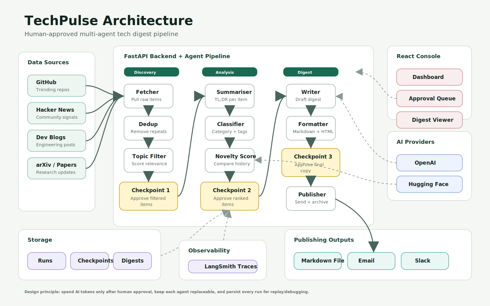

# TechPulse

Autonomous multi-agent tech digest system with human approval checkpoints.

TechPulse monitors developer and research signals, filters them, ranks them for novelty, drafts a digest, waits for human approval, and publishes to Markdown, email, and Slack.

## Architecture



```text
POST /api/run                         -> create a weekly digest run
GET  /api/checkpoint/current          -> fetch pending human approval
POST /api/checkpoint/{id}/approve     -> resume the next pipeline stage
GET  /api/digests                     -> list published digests
GET  /api/runs                        -> list run history
```

## Pipeline

1. **Discovery** - fetch items from GitHub, Hacker News, blogs, and research sources.
2. **Deduplication** - remove repeated or near-identical items.
3. **Topic filtering** - score items for relevance to AI, devtools, OSS, and infrastructure.
4. **Checkpoint 1** - approve filtered items before deeper analysis.
5. **Analysis** - summarise, classify, tag, and score novelty.
6. **Checkpoint 2** - approve ranked items before digest generation.
7. **Digest generation** - write Markdown and HTML versions.
8. **Checkpoint 3** - final approval before publishing.
9. **Publishing** - save Markdown locally and optionally send to Slack/Resend.

## Core Features

- Human-in-the-loop approval console
- Agent-style backend pipeline
- Digest archive and run history
- Local demo mode with no paid API keys required
- Optional provider keys for Hugging Face, Firecrawl, GitHub, LangSmith, Resend, and Slack
- Architecture prepared for LangGraph, PostgreSQL, Redis, and real LLM routing

## Tech Stack

| Layer | Technology |
|---|---|
| Backend | Python, FastAPI, async IO |
| Agent workflow | LangGraph-style staged pipeline |
| Frontend | React, TypeScript, Vite |
| Package managers | `uv` or `pip` for Python, `pnpm` or `npm` for JS |
| Current persistence | Local JSON + Markdown files |
| Production persistence | PostgreSQL + Redis |
| AI providers | Hugging Face, optional OpenAI |
| Observability | LangSmith |
| Publishing | Markdown, Resend email, Slack webhook |
| Deployment | Railway/Render backend, Vercel frontend |

## Local Setup

### 1) Infrastructure

For the current MVP, this step is optional because the app uses local JSON storage. Keep it for production-style local development:

```bash
docker compose -f infra/docker-compose.yml up -d
```

### 2) Backend

Recommended, matching the MediCall-style `uv` workflow:

```bash
cd backend
uv sync
uv run uvicorn api.main:app --reload --host 127.0.0.1 --port 8000
```

If you do not have `uv`, use regular Python:

```bash
cd backend
C:\Python314\python.exe -m pip install -r requirements.txt
C:\Python314\python.exe -m uvicorn api.main:app --reload --host 127.0.0.1 --port 8000
```

OpenAPI docs:

```text
http://localhost:8000/docs
```

### 3) Frontend

Recommended:

```bash
cd frontend
pnpm install
pnpm dev -- --host 127.0.0.1 --port 5174
```

If you do not use `pnpm`:

```bash
cd frontend
npm install
npm run dev -- --host 127.0.0.1 --port 5174
```

Open:

```text
http://localhost:5174
```

## Flow

1. Trigger a run from the dashboard.
2. Approve topic-filtered items.
3. Approve ranked/summarised items.
4. Approve the final digest.
5. The digest is saved locally and optionally sent to Slack/Resend when configured.

## Environment

Root backend configuration:

```text
.env
```

Frontend local configuration:

```text
frontend/.env.local
```

The current implementation defaults to local demo data if external services are absent, which keeps development fast and predictable.

Important backend variables:

| Variable | Description |
|---|---|
| `TECHPULSE_SUPABASE_URL` | Supabase project URL for backend persistence |
| `TECHPULSE_SUPABASE_SERVICE_ROLE_KEY` | Backend-only Supabase service role key |
| `HUGGINGFACEHUB_API_TOKEN` | Hugging Face token for future open-source LLM routing |
| `FIRECRAWL_API_KEY` | Blog/source crawling |
| `GITHUB_TOKEN` | Higher GitHub API rate limits |
| `SEMANTIC_SCHOLAR_API_KEY` | Research paper search |
| `LANGSMITH_API_KEY` | Agent tracing |
| `TECHPULSE_RESEND_API_KEY` | Email publishing |
| `TECHPULSE_SLACK_WEBHOOK_URL` | Slack publishing |

Frontend variables:

| Variable | Description |
|---|---|
| `VITE_API_BASE_URL` | FastAPI URL, usually `http://localhost:8000/api` |
| `VITE_SUPABASE_URL` | Supabase project URL for browser auth |
| `VITE_SUPABASE_ANON_KEY` | Supabase anon key for browser auth |

## Supabase Setup

1. Create a Supabase project.
2. Open Supabase SQL Editor and run [docs/supabase-setup.sql](docs/supabase-setup.sql).
3. In Supabase Dashboard, copy:
   - Project URL
   - anon public key
   - service role key
4. Add them to `.env`:

```env
TECHPULSE_SUPABASE_URL=https://your-project.supabase.co
TECHPULSE_SUPABASE_SERVICE_ROLE_KEY=your-service-role-key
```

5. Add browser auth keys to `frontend/.env.local`:

```env
VITE_SUPABASE_URL=https://your-project.supabase.co
VITE_SUPABASE_ANON_KEY=your-anon-key
```

Keep the service role key backend-only. Never put it in frontend env files.

## Project Structure

```text
TechPulse/
├── backend/
│   ├── agents/              # Fetch, dedup, filter, summarise, classify, score, write, publish
│   ├── api/                 # FastAPI app and REST routes
│   ├── db/                  # Local JSON store, later PostgreSQL
│   ├── graph/               # Pipeline orchestration
│   ├── config.py            # Settings
│   ├── pyproject.toml       # uv-compatible backend dependencies
│   └── requirements.txt     # pip-compatible backend dependencies
├── frontend/
│   ├── src/                 # React app
│   ├── .env.local           # Vite API URL
│   └── package.json
├── docs/
│   ├── ARCHITECTURE.md
│   └── techpulse-architecture.svg
├── infra/
│   └── docker-compose.yml   # Redis + PostgreSQL
└── .env                     # Backend secrets and provider keys
```
