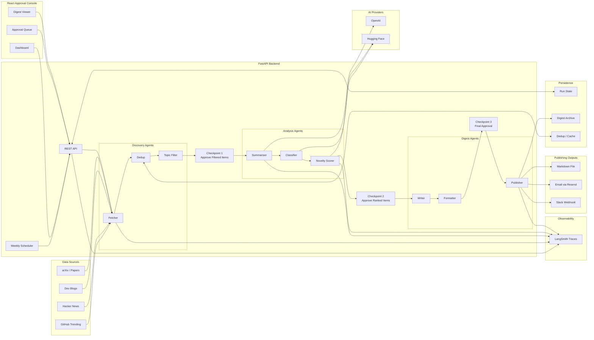

# TechPulse Architecture

TechPulse is a human-approved AI digest system. It collects technical signals from multiple sources, filters and ranks them, drafts a digest, waits for approval at key points, and publishes the final version.

## Simple Explanation

1. **Collect signals**  
   The backend fetches items from GitHub, Hacker News, blogs, and research sources.

2. **Clean and filter**  
   Duplicate or low-signal items are removed. The remaining items are scored for topic relevance.

3. **Human approval checkpoint 1**  
   You approve the filtered list before spending AI tokens on deeper analysis.

4. **AI analysis**  
   Approved items are summarised, classified into categories, tagged by stack, and scored for novelty against past digests.

5. **Human approval checkpoint 2**  
   You review the ranked items before generating the final digest.

6. **Digest generation**  
   The writer creates the digest, and the formatter produces Markdown and HTML.

7. **Human approval checkpoint 3**  
   You approve the final copy before publishing.

8. **Publish and archive**  
   The digest is saved locally and can be sent to email and Slack when API keys are configured.

## Senior-Level Design Notes

- **Human-in-the-loop by design:** approvals happen before expensive analysis, before final writing, and before publishing.
- **Agent separation:** each agent has one responsibility, making the pipeline easier to test, replace, and improve.
- **Provider routing:** expensive models can be reserved for summarisation while cheaper models handle tagging and scoring.
- **Replayable state:** every run, checkpoint, and digest is persisted so failed runs can be inspected or resumed.
- **Observability-ready:** LangSmith can trace the full path from source item to final digest.
- **Monetisation-ready:** publishing is decoupled, so email, Slack, Markdown, paid newsletters, or web archives can be added without rewriting the pipeline.
